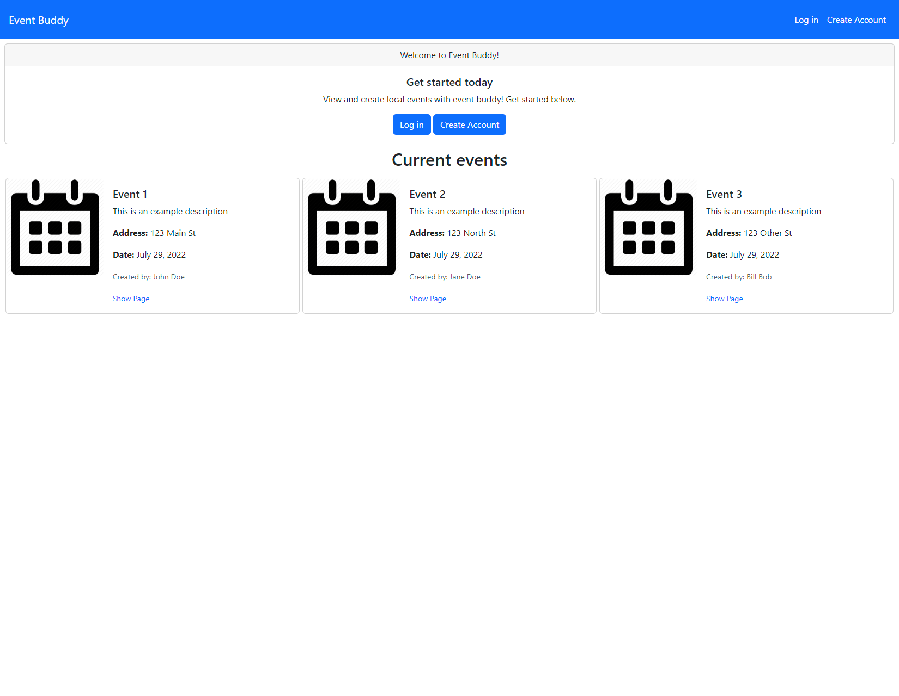

# Event Buddy

## Deployed Site
[Event Buddy](https://murmuring-springs-16959.herokuapp.com/)

## Screenshot

## Description
Event Buddy is a Node.JS application where a user is able to create events that other users may be interested in. The application allows for the creation of a user profile, multiple events, and comments on events. A user is also able to react to an event, which will save the event to their profile page so the user may refer back to it later. A user will also be able to share created events to other outlets, such as Facebook and Twitter.
*** 
At this time, reactions and sharing have not yet been implemented for client-side usage.
***

## Usage
In order to create, comment, or react to an event, a user must be registered and logged into the site, as well as have an authenticated email address. Authentication of email is performed after a user signs up. The user is then sent an email containing a URL to a route which will change their profile object's `is_auth_email` key from `false` to `true`.

## Tech Stack
- node
- express
- bootstrap
- bcrypt
- connect-session-express
- express-handlebars
- express-session
- mysql2
- nodemailer
- sequelize
- uuid

## License
Unlicensed